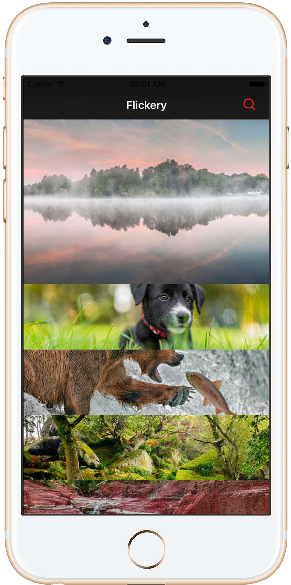
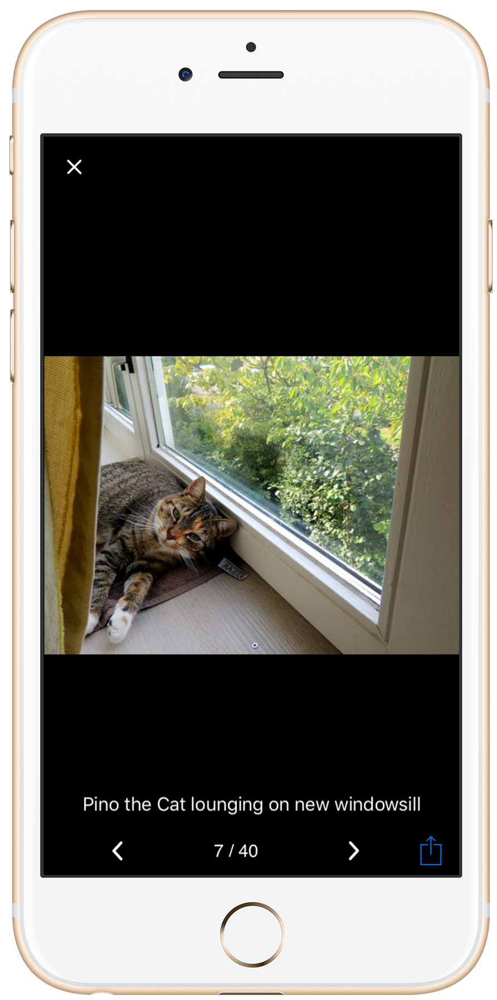
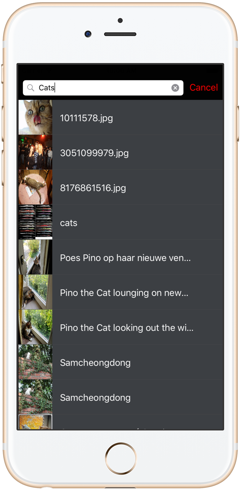
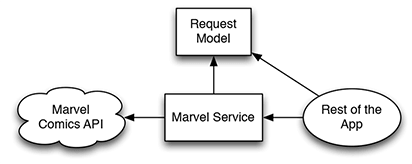
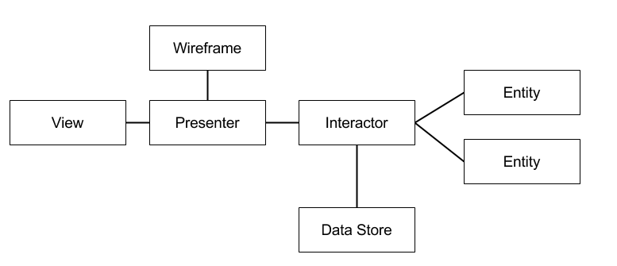

# Flickery
========================

[](https://developer.apple.com/iphone/index.action)
[](https://developer.apple.com/swift)
[](http://mit-license.org)

## Overview
iOS Flicker client that allow user searching for photos. Developed using Swift, VIPER and TDD.






## App Description

Using this application, users shall be able to search for photos with specific words. The data is available by connecting to the Flicker API https://www.flickr.com/services/api/.

**App use cases**

*List of Photos*:

- In this view, the App present a list of Photos loaded from interestingness - the list of interesting photos for the most recent day or a user-specified date from the Flicker Search API.

*Filter Results*:

- When tapping on the magnifier icon, you should be able to search for photos by name. To do this, use the flickr.photos.search endpoint used to return a list of photos matching some criteria.

*Photo Details*:

- When selecting a photo either from list screen or search screen, the App shall present a detail view of that photo. you can also browse all other search result photos from that details screen.

## Installation

Just clone the repo or download it in zip-file, Open the project in Xcode then test it on your iOS device or iOS simulator.

In case you want to change the project setup like Flicker API keys:

* Get your own keys from https://www.flickr.com/services/api/
* Inside Flickery/Flickery/AppConstants, change `KFlickeryFactory_APIKey` with your owen key.


# Xcode Project files structure
```bash
.swift
+-- AppDependencies
|   +-- AppDependencies.swift
+-- Common
|   +-- RootWireframe.swift
+-- AppDelegate
|   +-- AppDelegate.swift
+-- Storyboards
|   +-- Main.storyboard
|   +-- LaunchScreen.storyboard
+-- Extensions
|   +-- UIColor+Palette.swift
+-- Models
|   +-- RootClass.swift
|   +-- Photo.swift
+-- Assets
|   +-- Assets.xcassets
+-- Utility
|   +-- AppConstants
    |   +-- AppConstants
        |   +-- AppConstants.swift
+-- Flicker Base
|   +-- Networking
    |   +-- Factory
        |   +-- FlickerFactory.swift
        |   +-- FlickerFactory+Photos.swift
    |   +-- Client
        |   +-- Networking.swift
    |   +-- FlickerGateway.swift
+-- Modules
|   +-- List Photos
    |   +-- Application Logic
        |   +-- ListInteractor.swift
        |   +-- ListInteractorIO.swift
    |   +-- Module Interface
        |   +-- ListModuleInterface.swift
    |   +-- User Interface
        |   +-- Presenter
            |   +-- ListPresenter.swift
        |   +-- View
            |   +-- ListPhotosCollectionViewController.swift
            |   +-- SlidingMenuCell.swift
            |   +-- SlidingMenuLayout.swift
            |   +-- ListViewInterface.swift
        |   +-- Wireframe
            |   +-- ListWireframe.swift
|   +-- Filter Characters
    |   +-- Application Logic
        |   +-- FilterInteractor.swift
        |   +-- FilterInteractorIO.swift
    |   +-- Module Interface
        |   +-- FilterModuleInterface.swift
    |   +-- User Interface
        |   +-- Presenter
            |   +-- FilterPresenter.swift
        |   +-- View
            |   +-- FilterPhotosTableViewController.swift
            |   +-- FilterTableViewCell.swift
            |   +-- FilterViewInterface.swift
        |   +-- Wireframe
            |   +-- FilterWireframe.swift            
.swift tests
+-- FlickeryAuthenticationTests.swift 
+-- Interactor
|   +-- ListInteractorTests.swift
|   +-- FilterInteractorTests.swift
+-- Presenter
|   +-- ListPresenterTests.swift
|   +-- FilterPresenterTests.swift
+-- ViewController
|   +-- ListViewTests.swift
```

**AppDependencies** : Contains the code that is responsible for VIPER's module configuration.

**Common** : Contains common behavior between VIPER modules like RootWireframe, all modules wireframes use this RootWireframe.

**Extensions** : Contains Extensions like Color extension.

**Models** : Contains App Model layer.

**Assets** : Contains all resources like images used in the App.

**Utility** : Contains app utility classes like AppConstants that is a shared constant class between all classes.

**Flicker Base** : Is the core engine of the project. It contain the Networking logic (Networking.swift), `FlickerGateway.swift` that is implemented to acheive the Dependency Inversion Principle between networking logic and the rest of the App. And `FlickerFactory.swift` that implement/adopt to `FlickerGateway.swift` and finally the app dealing with it to get data from te network.

**Modules** : Contains all VIPER Architecture design patterns modules. Every module has it's owen layer/components like Interactor, Presenter, View, Entity, Routing a.k.a (Wireframe).

**FlickeryTests** : Contains all unit testing files like testing VIPER modules and FlickeryAuthenticationTests.


# Design Patterns used:

**Dependency inversion principle — the D of SOLID.** 

In object-oriented programming, the dependency inversion principle refers to a specific form of decoupling software modules. 
As Objects are like horses. The less they know about their chaotic surroundings, the easier it is to control them.
We don’t want our objects to be spooked when there’s a lot going on. So let’s build ignorance into our systems.

I used this techniqe in the network layer:

The classic way to invert a dependency is to extract a protocol. (If you’re an Android developer, when you see “protocol,” think “interface.”) We’ll call it the Flicker Gateway. In the following diagram, it’s marked with <P> to show that it’s a protocol:



To make our API service layer more ignorant about most of the app, it has to implement the marvel gateway protocol. The prtocol act as a contract.
Thanks to Dependency Inversion, the rest of the app can now be ignorant. It knows about the contract, but not about any class that satisfies that contract.
Anything that implements the protocol can be plugged in. The Flicker Gateway serves as a Boundary.

You can read more about DIP [HERE](http://code.tutsplus.com/tutorials/solid-part-4-the-dependency-inversion-principle--net-36872)
# VIPER Architecture design pattern:

**What is VIPER?**
VIPER is an application of Clean Architecture to iOS apps. The word VIPER is a backronym for View, Interactor, Presenter, Entity, and Routing. Clean Architecture divides an app’s logical structure into distinct layers of responsibility. This makes it easier to isolate dependencies (e.g. your database) and to test the interactions at the boundaries between layers:


- Know more about VIPER through this post http://www.objc.io/issue-13/viper.html

**Why VIPER**:

*Smaller files*:

- VIPER (without a few exceptions:) ) has very clear politics about responsibility for each component. It helps with reducing amount of code in files and putting into the right place according to a single responsibility principle. 

*Better code coverage*: 

- Smaller classes mean smaller test cases as well. Tests resort less to exotic tricks and are simpler to read. The barrier to entry to write unit tests is lower, so more developers write them. 

*Good for unit testing*:

- On the basis of VIPER principles, everything in one module is very well separated, so it creates good environment for unit testing. Look at [this](http://iosunittesting.com/tdd-with-viper/?utm_source=swifting.io) article regarding more info about TDD in VIPER.

**VIPER modules Generators** : 

If you really want to make your application based on VIPER architecture, do not even think to make it all manually. It will be a disaster! You need an automated process to create a new module.

By the way I've created an opens source tool that automate the process of generating VIPER modules.
* [ViperCode](https://github.com/iSame7/VIPER-Module)


# Dependency Injection:

Use of VIPER architecture gives great possibility to apply dependency injection. For example, let’s consider an example of a presenter:

```swift
class MapPresenter: MapPresenting {
    private weak var view: MapViewable?
    private let mapInteractor: MapInteracting
    private let router: MapRoutable
    
    init(view: MapViewable?, mapInteractor: MapInteracting, router: MapRoutable) {
        self.view = view
        self.mapInteractor = mapInteractor
        self.router = router
    }
    
    func viewDidLoad() {
        mapInteractor.determineUserLocation { [weak self] location in
            self?.view?.updateUserLocation(MapViewController.LocationViewModel(lat: location.lat, lng: location.lng))
        }
    }
    
    func getRestaurantsAround(coordinate: String) {
        mapInteractor.getRestaurantsAround(coordinate: coordinate) { [weak self] (venues, error) in
            if let venues = venues {
                self?.view?.update(venues)
            } else if let error = error {
                self?.view?.showError(error: error)
            }
        }
    }
    
    func getPhotos(venueId: String) {
        mapInteractor.getVenuePhotos(venueId: venueId) { [weak self] photos in
            print("Photos: \(photos)")
            if !photos.isEmpty {
                let photo = "\(photos[0].prefix)700x500\(photos[0].suffix)"
                self?.view?.update(with: photo, for: venueId)
            }

        }
    }
    
    func showDetailsViewController(venue: Venue, venuePhotoURL: String?) {
        guard let vmapViewController = view as? UIViewController else { return }
        
        router.navigateToDetailsModule(navController: vmapViewController.navigationController, venue: venue, venuePhotoURL: venuePhotoURL)
    }
}
```

Injection in this class gave us two advantages:

* We have a better sense what’s going on in this code. We see immediately what dependencies our class has
* On the other hand, our class is prepared for unit testing

*When using VIPER architecture a good practice is to use DI in every component. i will show in Unit Test section a few examples how this approach can really help us during testing.


# Unit testing:

I started from testing interactor and presenter, because interactor contains main business logic and presenter contains logic responsible for preparing data before displaying. These components seems more critical than others.

Libraries/Frameworks i used for unit tests and TDD:

* XCTest


In VIPER every component of a module is strictly separated what creates a very friendly scenario for adopting unit tests in terms of single responsibility principle:

let’s consider an example of a presenter of List Characters Module:

by separating components in our test we can focus only on testing responsibility of interactor. The others components which talk with interactor are just mocked.

How does it look like in perspective of code?

```swift
class MapPresenterTests: XCTestCase {
    // MARK: - Test variables
    private let mockMapViewController = MockMapViewController()
    private let mockMapInteractor = MockMapInteractor()
    private let mockDetailsModuleBuilder = MockDetailsBuilder()
    private let mockNavigationController = MockNavigationController()
    private var mockRouter = MockRouter()
    private var sut: MapPresenter?
    
    private let mockVenue = Venue(id: "123", name: "Restaurant A", contact: nil, location: Location(lat: 52.36795609763071, lng: 4.895555168247901, address: "Nieuwe Doelenstraat 20-22", crossStreet: nil, distance: nil, postalCode: "1012 CP", cc: nil, city: "Amsterdam", state: "North Holland", country: "Netherlands"), categories: [Category(id: "4bf58dd8d48988d16d941735", name: "Café", pluralName: "Cafés", shortName: "Café", icon: Category.Icon(prefix: "https://ss3.4sqi.net/img/categories_v2/food/cafe_", suffix: ".png"), primary: nil)], verified: false, url: nil, stats: nil, likes: nil, rating: nil, hours: nil, photos: nil, tips: nil)
    
    // MARK: - Test life cycle
    override func setUp() {
        sut = MapPresenter(view: mockMapViewController, mapInteractor: mockMapInteractor, router: mockRouter)
    }
    
    // MARK: - Tests
    func testIsMapViewLoaded() {
        sut?.viewDidLoad()
        
        XCTAssertNotNil(mockMapViewController.locationViewModel)
        XCTAssertEqual(mockMapViewController.locationViewModel.lat, 52.36795609763071)
        XCTAssertEqual(mockMapViewController.locationViewModel.lng, 4.895555168247901)
    }
    
    func testGetRestaurantsArountCoordinate() {
        sut?.getRestaurantsAround(coordinate: "52.362305405787325,4.8999109843211")
        XCTAssertNotNil(mockMapViewController.venues)
        XCTAssertEqual(mockMapViewController.venues.count, 2)
        XCTAssertEqual(mockMapViewController.venues.first?.name, "Restaurant A")
        XCTAssertEqual(mockMapViewController.venues.first?.location.lat, 52.36795609763071)
        XCTAssertEqual(mockMapViewController.venues.first?.location.lng, 4.895555168247901)
        XCTAssertEqual(mockMapViewController.venues.first?.location.address, "Nieuwe Doelenstraat 20-22")
        XCTAssertEqual(mockMapViewController.venues[1].name, "Starbucks")
        XCTAssertEqual(mockMapViewController.venues[1].location.lat, 52.36607678472145)
        XCTAssertEqual(mockMapViewController.venues[1].location.lng, 4.897430803910262)
        XCTAssertEqual(mockMapViewController.venues[1].location.address, "Utrechtsestraat 9")
    }
    
    func testGetRestaurantsAroundCoordinateWithError() {
        sut?.getRestaurantsAround(coordinate: "")
        
        XCTAssertNotNil(mockMapViewController.error)
        XCTAssertEqual(mockMapViewController.error, .noResponse)
    }
    
    func testGetPhotosForVenue() {
        sut?.getPhotos(venueId: "4f019124a69d45461f2458e7")
        
        XCTAssertNotNil(mockMapViewController.venuePhotoURL)
        XCTAssertNotNil(mockMapViewController.venueId)
        
        XCTAssertEqual(mockMapViewController.venuePhotoURL, "https://fastly.4sqi.net/img/general/700x500/WfIypTz_PxPvh75QSIBwomCu-jK_72UDiBauHc6L1dU.jpg")
    }
    
    func testIsDetailsModulePushedInNavigationController() {
        sut?.showDetailsViewController(venue: mockVenue, venuePhotoURL: "")
        
        XCTAssertTrue(mockRouter.didGoToDetailsModule)
    }
}

private class MockMapViewController: UIViewController, MapViewable {
    var locationViewModel: MapViewController.LocationViewModel!
    var venues: [Venue]!
    var error: FoursquareError!
    var venuePhotoURL: String!
    var venueId: String!
    
    func update(_ model: [Venue]) {
        venues = model
    }
    
    func showError(error: FoursquareError) {
        self.error = error
    }
    
    func update(with photo: String, for venueId: String) {
        venuePhotoURL = photo
        self.venueId = venueId
    }
    
    func updateUserLocation(_ locationViewModel: MapViewController.LocationViewModel) {
        self.locationViewModel = locationViewModel
    }
}

private class MockMapInteractor: MapInteracting {
    func getRestaurantsAround(coordinate: String, completion: @escaping ([Venue]?, FoursquareError?) -> Void) {
        if !coordinate.isEmpty {
            let mockVenue1 = Venue(id: "123", name: "Restaurant A", contact: nil, location: Location(lat: 52.36795609763071, lng: 4.895555168247901, address: "Nieuwe Doelenstraat 20-22", crossStreet: nil, distance: nil, postalCode: "1012 CP", cc: nil, city: "Amsterdam", state: "North Holland", country: "Netherlands"), categories: [Category(id: "4bf58dd8d48988d16d941735", name: "Café", pluralName: "Cafés", shortName: "Café", icon: Category.Icon(prefix: "https://fastly.4sqi.net/img/general/", suffix: "/WfIypTz_PxPvh75QSIBwomCu-jK_72UDiBauHc6L1dU.jpg"), primary: nil)], verified: false, url: nil, stats: nil, likes: nil, rating: nil, hours: nil, photos: nil, tips: nil)
            
            let mockVenue2 = Venue(id: "4f019124a69d45461f2458e7", name: "Starbucks", contact: nil, location: Location(lat: 52.36607678472145, lng: 4.897430803910262, address: "Utrechtsestraat 9", crossStreet: nil, distance: nil, postalCode: "1017 CV", cc: nil, city: "Amsterdam", state: "North Holland", country: "Netherlands"), categories: [Category(id: "4bf58dd8d48988d16d941735", name: "Coffee Shops", pluralName: "Coffee Shops", shortName: "Coffee Shops", icon: Category.Icon(prefix: "https://ss3.4sqi.net/img/categories_v2/food/coffeeshop_", suffix: ".png"), primary: nil)], verified: false, url: nil, stats: nil, likes: nil, rating: nil, hours: nil, photos: nil, tips: nil)
            completion([mockVenue1, mockVenue2], nil)
        } else {
            completion(nil, .noResponse)
        }
    }
    
    func getVenuePhotos(venueId: String, completion: @escaping ([Photo]) -> Void) {
        let photo1 = Photo(id: "4fe03279e4b0690a86767319", prefix: "https://fastly.4sqi.net/img/general/", suffix: "/WfIypTz_PxPvh75QSIBwomCu-jK_72UDiBauHc6L1dU.jpg", width: 720, height: 540, visibility: "public", source: Source(name: "Foursquare for iOS", url: "https://foursquare.com/download/#/iphone"))
        let photo2 = Photo(id: "51dbe1e9498e361de7fccbb7", prefix: "https://fastly.4sqi.net/img/general/", suffix: "/9664729_cr9GMPE2yxpPO_e4CFx5xtyNdjWqNQa06SZBO3aFbio.jpg", width: 720, height: 720, visibility: "public", source: Source(name: "Foursquare for iOS", url: "https://foursquare.com/download/#/iphone"))
        completion([photo1, photo2])
    }
    
    func determineUserLocation(completion: @escaping UserLocationBlock) {
        completion(Location(lat: 52.36795609763071, lng: 4.895555168247901, address: "Nieuwe Doelenstraat 20-22", crossStreet: nil, distance: nil, postalCode: nil, cc: nil, city: nil, state: nil, country: nil))
    }
}

private class MockRouter: MapRoutable {
    var didGoToDetailsModule = false
    func navigateToDetailsModule(navController: NavigationControlling?, venue: Venue, venuePhotoURL: String?) {
        didGoToDetailsModule = true
    }
}
```
